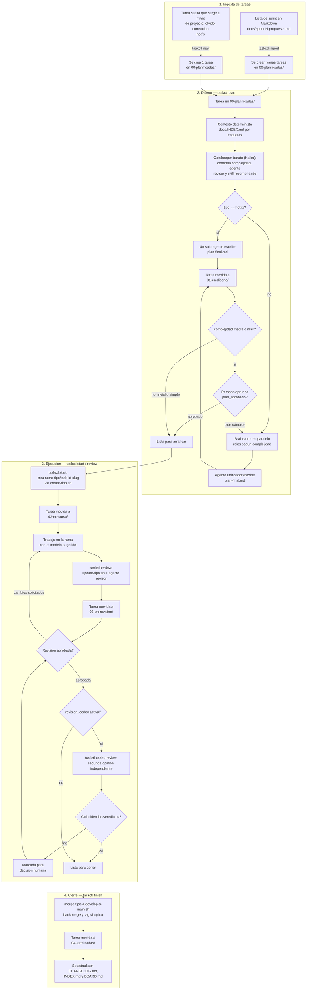

# TaskCode — Propuesta de metodología de trabajo

Estado: **borrador para discusión, v15** (fase de estudio y planificación, sin código todavía).
Última actualización: 2026-09-03.

## 1. Objetivo

Un método que cualquier integrante del equipo pueda seguir sin depender de que alguien "recuerde" en qué punto va cada tarea. La idea central: **el repo es el tablero** para los datos del proyecto (tareas, planes, revisiones), pero **la herramienta vive en el plugin**, no en el repo — así cualquiera que instale el plugin tiene el mismo `taskctl` y los mismos scripts de Git-Flow funcionando, sin depender de que ese repo en concreto los tenga committeados. Ver sección 7.

## 2. Qué vive en el plugin vs. qué vive en cada repo

Esta separación es la corrección clave de esta versión:

```
EL PLUGIN (se instala una vez, se comparte con todo el equipo)         → distribuye la herramienta
  taskcode-plugin/
    .claude-plugin/plugin.json
    bin/
      taskctl                      ← ejecutable, entra automáticamente en el PATH del Bash tool
    scripts/
      catalogo-skills.yml       # registro de skills propios y externos, ver 6.6
      heuristica-complejidad.yml # pesos por defecto de la heuristica, ver 16.1
      gitflow/
        _gitflow-common.sh
        create-feature.sh / create-fix.sh / create-hotfix.sh / create-release.sh
        update-feature.sh / update-fix.sh / update-release.sh / update-hotfix.sh
        merge-feature-to-develop.sh / merge-fix-to-develop.sh
        merge-release-to-main.sh / merge-hotfix-to-main.sh
        diagnose-repo.sh / pause-work.sh / resume-work.sh / recover-branch.sh / abort-merge.sh
    skills/
      task-workflow/SKILL.md       ← cuándo y cómo usar taskctl, el ciclo de vida completo
      java-spring-reviewer/SKILL.md
      angular-vue-reviewer/SKILL.md
      csharp-autocad-ifc-reviewer/SKILL.md
      code-quality-reviewer/SKILL.md
    agents/                        ← definiciones de los roles de brainstorm (arquitectura, riesgos, testing, dominio)
    commands/                      ← slash-commands de conveniencia (opcional, envuelven taskctl)

CADA REPO DE PROYECTO (datos propios de ese proyecto, sí se versiona ahí)
  /tareas/00-planificadas/ … /04-terminadas/
  /docs/adr/, CHANGELOG.md, INDEX.md, BOARD.md
  .taskcode/config.yml             ← lo único de configuración que vive en el repo, ver 7.3
```

Cada carpeta de tarea sigue igual que en v3 (una carpeta por tarea, con `tarea.md` + `planificacion/` + `revision/`, nunca se borra).

## 3. Cómo entra una tarea al sistema (dos vías, no una)

Esto faltaba y lo corrijo aquí: no todas las tareas nacen de una planificación de sprint. Hay dos vías de entrada, ambas terminan igual — una carpeta nueva en `00-planificadas/` — pero cubren momentos distintos del proyecto:

**3.1 Ingesta masiva (planificación de sprint)**
Se arranca cada sprint con un documento (`docs/sprint-3-propuesta.md`) con todas las tareas propuestas en formato fijo. `taskctl import docs/sprint-3-propuesta.md` crea una carpeta `TASK-<id>/` por bloque en `00-planificadas/`, con IDs correlativos y frontmatter completo.

**3.2 Alta individual (a mitad de proyecto)**
Para lo que mencionas: una tarea que se había quedado fuera de la lista original, o una corrección que aparece mientras el sprint ya está en marcha. `taskctl new "Título de la tarea" --tipo fix --etiquetas ifc,importador` crea una única carpeta de tarea en `00-planificadas/`, con el mismo frontmatter que si viniera de una importación — la diferencia es solo el origen, no el formato. Para `tipo: hotfix`, `taskctl new` es prácticamente siempre la vía de entrada (un hotfix casi nunca estaba planificado de antemano).

Las dos vías convergen en el mismo punto del flujo — ver el diagrama de la sección 5.

## 4. Plantilla de tarea (`tarea.md`)

```yaml
---
id: TASK-014
titulo: "Añadir validación de espesor de muro en importador IFC"
tipo: feature            # feature | fix | hotfix | release
sprint: 3
etiquetas: [ifc, importador, validacion]
complejidad: media
modelo_sugerido: sonnet
estado: planificada
plan_aprobado: false
rama: feature/task-014-validacion-espesor-muro
asignado_a: null
agente_revisor: csharp-autocad-ifc-reviewer
skills_recomendados: []      # se completa en la fase de diseño, ver 6.6
ultimo_commit_revisado: null  # lo actualiza taskctl review, ver 16.3
revision_codex: false
creado: 2026-09-03
actualizado: 2026-09-03
dependencias: []
---
## Objetivo
...
## Criterios de aceptación
- [ ] ...
```

## 5. Ciclo de vida de una tarea

```
planificada → en-diseño → en-curso → en-revision → terminada
                              ↑             |
                              └── cambios solicitados
```

Versión completa como flowchart — vive también como archivo independiente en `docs/diagramas/workflow-tarea.mmd`, para verlo en cualquier visor de Mermaid o pegarlo en la wiki:



## 6. Fase de diseño previa a la implementación (kickoff de tarea)

`taskctl plan <id>`: contexto determinista desde `docs/INDEX.md` (nunca un agente leyendo todo el histórico) → resolución **determinista** de `agente_revisor` y nº de agentes de brainstorm (lookups, sin LLM — ver sección 16) → heurística de complejidad, con Haiku solo si discrepa de lo declarado (sección 16) → **selección de skill (6.6)**, top-1 determinista salvo empate → brainstorm en paralelo con roles distintos (0 agentes en trivial → 3-4 en crítica) → agente unificador que documenta también los desacuerdos → checkpoint humano opcional (`plan_aprobado`) recomendado desde complejidad media. Para `hotfix`, se salta el brainstorm multi-agente (sección 7.5).

**6.6 Selección de skill para ejecutar la tarea**

Coincido en que vale la pena construir esto bien — es exactamente el mismo problema que ya resolvimos para el contexto (sección 6.1): mejor recuperación determinista + un juicio barato encima, que un agente "buscando" a ciegas. Distingo dos casos:

- **Elegir el agente revisor (`agente_revisor`)**: siempre entre los skills empaquetados en `taskcode-plugin` (sección 9) — nunca falta ninguno, se instalan todos juntos con el plugin.
- **Elegir skills que ayuden a *ejecutar* la tarea** (`skills_recomendados`): aquí sí puede hacer falta algo externo — Figma si la tarea toca diseño, Auth0 si toca login, docx/pdf si hay que generar un entregable, etc.

**Diseño en dos pasos, no uno solo:**

1. **Recuperación determinista** contra `scripts/catalogo-skills.yml`, un catálogo propio versionado dentro del plugin — no una búsqueda libre. Cada entrada:
   ```yaml
   - id: java-spring-reviewer
     origen: taskcode-plugin        # empaquetado, siempre instalado
     rol: revisor                   # revisor | ejecucion | ambos
     prioridad: 10                  # desempate determinista, ver 16.4
     etiquetas: [java, spring, backend]
     patrones_archivo: ["**/*.java", "src/main/java/**"]  # enrutado por diff real, ver 16.5
     descripcion: "Revisión de capas de servicio/repositorio, transacciones Spring Boot"

   - id: figma:figma-generate-design
     origen: externo
     marketplace: figma
     rol: ejecucion
     prioridad: 5
     etiquetas: [figma, diseno, ui, mockup]
     descripcion: "Traducir una vista o pantalla a un diseño de Figma"
   ```
   `taskctl` cruza las `etiquetas` de la tarea contra el catálogo y devuelve un top-N de candidatos por solape — sin LLM todavía, así que escala aunque el catálogo crezca a cientos de entradas. El catálogo lo mantiene el equipo a mano (se añade una línea cuando alguien quiere que un skill externo entre en el radar), igual que cualquier otro archivo del plugin.

2. **Juicio barato sobre ese top-N**, no sobre el catálogo entero: el gatekeeper (Haiku, mismo paso de 6.2) elige entre los 2-3 candidatos recuperados cuál encaja mejor con el objetivo real de la tarea — las etiquetas no siempre cuentan toda la historia, y para eso vale la pena un LLM barato en vez de forzar el matching a ser 100% mecánico.

3. **Comprobar si está instalado — determinista, no un tool call de un agente dentro de la sesión.** Para `origen: taskcode-plugin` siempre es sí. Para `origen: externo`, `taskctl` (el script, no un agente) comprueba directamente el estado local de plugins de esa máquina, en vez de pedirle a un agente que "busque lo instalado" en medio de su razonamiento — es más determinista y no depende de si esa capacidad está pensada para usarse así desde dentro de un skill. **Aviso**: la investigación sobre el mecanismo exacto para esa comprobación (comando de CLI / archivo de configuración concreto) devolvió una respuesta que no puedo dar por verificada sin probarla a mano — se queda como "a confirmar en Sprint 0", no como dato cerrado. Lo que sí es un principio de diseño sólido, con o sin ese detalle: la comprobación de "¿está instalado?" debe resolverla el script de forma determinista, y el agente solo entra para el paso 2 (elegir entre candidatos).

4. Si el candidato elegido no está instalado, se anota en `plan-final.md`: *"Esta tarea se beneficiaría del skill `X` (marketplace `Y`) — no está instalado. Instálalo con `/plugin install X@Y` antes de arrancar, o continúa sin él."* Nunca se instala nada automáticamente — requiere aprobación humana, como en cualquier instalación de plugin en Claude Code.

## 7. El plugin como unidad de distribución de la herramienta

Revisé `runConfigurations.zip`: ya existe un Git-Flow completo (22 run configurations + 18 scripts Bash) con ramas `feature/fix/hotfix/release`, previews de merge, logging, backmerge/tag automático, y herramientas de apoyo. Tu corrección es acertada: si esos scripts quedan en el repo (aunque sea en una carpeta compartida como propuse en v3), cada proyecto nuevo tendría que copiarlos, y cualquier mejora habría que replicarla manualmente proyecto por proyecto. Metiéndolos **dentro del plugin**, se instalan una vez y funcionan igual en cualquier repo donde el equipo trabaje.

**7.1 Cómo funciona técnicamente (confirmado contra la documentación actual de Claude Code)**
- Un plugin se instala en una ruta estable y versionada en la máquina de cada persona (`~/.claude/plugins/cache/<marketplace>/<plugin>/<version>/`).
- La variable de entorno `${CLAUDE_PLUGIN_ROOT}` apunta, en tiempo de ejecución, a la raíz del plugin instalado — es lo que usa `taskctl` para localizar sus propios scripts sin importar en qué máquina corre.
- `bin/` es una carpeta con estatus especial: cualquier ejecutable ahí dentro se añade automáticamente al `PATH` del Bash tool. Por eso `taskctl` va en `bin/` — cualquiera que tenga el plugin instalado puede escribir `taskctl start TASK-014` desde cualquier repo, sin rutas ni permisos que configurar.
- Los scripts de Git-Flow van en `scripts/gitflow/` dentro del plugin (no tienen el estatus especial de `bin/`, así que `taskctl` los invoca por ruta completa: `"$CLAUDE_PLUGIN_ROOT/scripts/gitflow/create-feature.sh"`).
- En Windows, el Bash tool de Claude Code ya usa Git Bash de forma nativa (con PowerShell como fallback si no está instalado) — a diferencia de IntelliJ, que necesita apuntar a `bash.exe` a mano con ruta corta 8.3. Es razonable esperar que los `.sh` actuales funcionen sin ese workaround al invocarse desde el plugin, pero no está documentado con ese nivel de detalle — **hay que validarlo como primer paso del Sprint 0**, no asumirlo.

**7.2 Qué SÍ queda en cada repo de proyecto**
Solo datos, nunca herramienta: las carpetas `tareas/`, `docs/`, y un archivo mínimo de configuración `.taskcode/config.yml` con lo que es específico de ese repo y el plugin no puede asumir — por ejemplo:
```yaml
rama_principal: main       # o master, según el repo
remoto: origin
politica_no_borrar_ramas: true   # IECA
agente_revisor_por_defecto: code-quality-reviewer
```
Esto es justo lo contrario de lo que tenía v3 (mover los scripts a `/scripts/gitflow/` del repo) — con esta corrección, ya no hace falta copiar ni versionar ningún script dentro de cada proyecto.

**7.3 Consecuencia importante: versionado centralizado**
Hoy los scripts en `.idea/runConfigurations/local_git-flow-actions/` son locales — cada persona podría tener una copia ligeramente distinta sin que nadie se entere. Con el plugin, todo el equipo corre exactamente la misma versión de `taskctl` y de los scripts de Git-Flow (la que tengan instalada), y una mejora se distribuye actualizando el plugin, no editando archivos repo por repo.

**7.4 Hotfix como tipo de primera clase**
Sin cambios respecto a v3: `taskctl start` con `tipo: hotfix` llama a `create-hotfix.sh` (rama desde `main`), `taskctl finish` llama a `merge-hotfix-to-main.sh` (backmerge + tag automáticos, ya incluidos en el script existente).

**7.5 Hotfix y la fase de diseño**
Para `tipo: hotfix`, `taskctl plan` genera `plan-final.md` con un solo agente, sin brainstorm multi-agente — la urgencia no debería esperar una ronda de consenso, pero sigue quedando documentado.

**7.6 Nomenclatura de ramas**
`tipo/task-<id>-<slug>` en minúsculas, calculada siempre por `taskctl` — nadie vuelve a teclear un nombre de rama.

**7.7 Política de no borrar ramas (IECA)**
Los scripts ya la respetan (nunca hacen `branch -d`, siempre `push --all`). El flag `politica_no_borrar_ramas` en `.taskcode/config.yml` (7.2) deja esto explícito y auditable por repo, y las carpetas de `04-terminadas/` tampoco se borran nunca — mismo principio.

**7.8 Herramientas de apoyo**
`taskctl diagnose` / `pause` / `resume` / `recover` / `abort-merge` — wrappers directos de los scripts existentes, ahora también dentro del plugin, disponibles en cualquier repo sin instalación adicional.

**7.9 Fuera de alcance a propósito**
Mirror to Remote / Switch Working Remote / Push Back to Remote no tienen relación con el flujo de tareas. Como los scripts siempre operan contra "el `origin` actual", seguirán funcionando igual tras un cambio de remoto — no necesitan integrarse con `taskctl`. (Podrían, más adelante, empaquetarse también en el plugin como utilidades independientes — no es prioritario ahora.)

**7.10 Distribución: marketplace privado en tu GitHub**

Decidido: un repo **privado** en tu GitHub hace de marketplace. Estructura propuesta (monorepo — marketplace y plugin juntos, más simple para un equipo pequeño; ver nota de riesgo abajo):

```
github.com/<tu-usuario>/taskcode-marketplace/     (repo privado)
  .claude-plugin/
    marketplace.json
  plugins/
    taskcode-plugin/
      .claude-plugin/plugin.json
      bin/taskctl
      scripts/gitflow/...
      skills/...
      agents/...
```

`marketplace.json`:
```json
{
  "name": "taskcode-marketplace",
  "owner": { "name": "Carlos" },
  "plugins": [
    {
      "name": "taskcode-plugin",
      "source": "./plugins/taskcode-plugin",
      "description": "Task-flow y Git-Flow para TaskCode",
      "version": "0.1.0"
    }
  ]
}
```

**Flujo para cada integrante del equipo**:
1. Tú les das acceso de lectura al repo `taskcode-marketplace` en GitHub (colaborador o miembro de la organización — es un repo privado, así que sin esto no pueden clonarlo).
2. Cada uno ejecuta una vez: `/plugin marketplace add <tu-usuario>/taskcode-marketplace`
3. Luego: `/plugin install taskcode-plugin@taskcode-marketplace`
4. La autenticación al ser privado usa las credenciales Git/GitHub que cada persona ya tenga configuradas (SSH o `gh` CLI) — no hay un mecanismo de token aparte que montar.

**Versionado**: fijar el campo `"version"` explícito en `marketplace.json` (no omitirlo) y subirlo deliberadamente en cada release del plugin — así nadie recibe un cambio de metodología o de scripts a mitad de un sprint sin enterarse. Actualizar es `/plugin marketplace update taskcode-marketplace` (o reinstalar).

**Dos cosas sin confirmar oficialmente en la documentación, a validar en la práctica antes de depender de esto**: (a) que el layout monorepo (marketplace.json + carpeta del plugin en el mismo repo) funcione igual de bien que tenerlos en repos separados — es coherente con los ejemplos documentados pero no está explícitamente avalado; (b) el comportamiento exacto de actualización (¿se aplica en la próxima sesión automáticamente, o hace falta el `update` manual siempre?). Ninguna de las dos bloquea el plan, pero conviene probarlas en el Sprint 0 antes de anunciarlo al equipo como "ya funciona".

**Bonus — que el propio plugin se proponga solo**: `marketplace.json` admite un bloque `relevance` por plugin (señales como archivos presentes en el directorio de trabajo) que hace que Claude Code sugiera proactivamente instalar el plugin cuando detecta esas señales — sin que nadie tenga que buscarlo. Tiene sentido declarar como señal la presencia de `tareas/` o `.taskcode/config.yml` en el repo: alguien que abra un proyecto TaskCode sin el plugin instalado vería la sugerencia de instalarlo solo. Esto resuelve, a nivel del plugin completo, la misma idea que 6.6 resuelve a nivel de cada tarea.

## 8. Scripts deterministas (`taskctl`, dentro de `bin/` del plugin)

| Comando | Qué hace | Script del plugin que invoca |
|---|---|---|
| `taskctl import <lista.md>` | Crea una carpeta de tarea por bloque en `00-planificadas/` | — (nuevo) |
| `taskctl new "<título>" --tipo ... --etiquetas ...` | Crea una única tarea en `00-planificadas/`, para altas a mitad de proyecto (olvidos, correcciones, hotfix) | — (nuevo) |
| `taskctl plan <id>` | Contexto + gatekeeper + brainstorm (o plan directo si hotfix) + unificación | — (nuevo) |
| `taskctl approve <id>` | Marca `plan_aprobado: true` o reabre el brainstorm | — (nuevo) |
| `taskctl start <id>` | Calcula rama, mueve carpeta a `02-en-curso/` | `scripts/gitflow/create-<tipo>.sh` |
| `taskctl review <id>` | Trae cambios de base, mueve a `03-en-revision/`, dispara agente(s) revisor(es) | `scripts/gitflow/update-<tipo>.sh` |
| `taskctl codex-review <id>` | Segunda opinión independiente con Codex CLI | — (nuevo) |
| `taskctl finish <id>` | Merge, mueve a `04-terminadas/`, actualiza changelog/índice/tablero | `scripts/gitflow/merge-<tipo>-to-develop\|main.sh` |
| `taskctl board` | Regenera `docs/BOARD.md` | — (nuevo) |
| `taskctl diagnose` / `pause` / `resume` / `recover` / `abort-merge` | Wrappers directos | `scripts/gitflow/diagnose-repo.sh` etc. |

**8.1 Máquina de estados: el orden de los comandos no es opcional**

Sí, es posible, y además es barato — es exactamente el mismo principio que ya venimos aplicando en todo el documento: que lo mecánico lo resuelva un script determinista, no que dependa de que alguien se acuerde. Cada comando de `taskctl`, antes de tocar nada, hace tres cosas: busca la tarea por ID, lee su `estado` actual en el frontmatter de `tarea.md` (contrastado contra en qué carpeta numerada vive de verdad — si no coinciden, es un error de integridad y también se aborta), y comprueba contra una tabla de transiciones fija si el comando invocado es legal desde ese estado. Si no lo es, aborta sin tocar nada — ni Git, ni carpetas — y explica qué comando hacía falta ejecutar antes.

| Comando | Estado de partida requerido | Estado resultante | Si no se cumple |
|---|---|---|---|
| `taskctl import` / `taskctl new` | la tarea no existe todavía **+ rama base limpia, ver 8.3** | `planificada` | Error si el ID ya existe, o si no se cumple 8.3 |
| `taskctl plan` | `planificada` (primera vez), o `en-diseno` con `plan_aprobado: false` (re-planificar tras cambios pedidos) **+ rama base limpia, ver 8.3** | `en-diseno` | *"La tarea no existe todavía — usa taskctl import o taskctl new primero"* / *"el plan ya fue aprobado, usa taskctl start"* / lo de 8.3 |
| `taskctl approve` | `en-diseno` con `plan-final.md` ya generado **+ rama base limpia, ver 8.3** | `en-diseno` (`plan_aprobado: true`) | *"Todavía no hay un plan que aprobar — ejecuta taskctl plan primero"* / lo de 8.3 |
| `taskctl start` | `en-diseno` y (`plan_aprobado: true`, o complejidad trivial/simple que no lo exige) | `en-curso` | *"Esta tarea no ha pasado por taskctl plan"* |
| `taskctl review` | `en-curso` | `en-revision` | *"Esta tarea no está en curso — usa taskctl start primero"* |
| `taskctl codex-review` | `en-revision`, revisión primaria ya aprobada, `revision_codex: true` | `en-revision` | *"Todavía no hay una revisión primaria aprobada"* |
| `taskctl finish` | `en-revision`, revisión (y Codex si aplica) aprobadas | `terminada` | *"Esta tarea no ha pasado revisión todavía"* |

Tu ejemplo exacto: `taskctl start TASK-014` con `TASK-014` todavía en `planificada` — taskctl lee el estado, ve que no es `en-diseno`, y aborta antes de invocar ningún script de Git-Flow:
```
[ERROR] TASK-014 esta en estado "planificada", no en "en-diseno".
        taskctl start requiere haber ejecutado taskctl plan primero.
        Ejecuta: taskctl plan TASK-014
```
Mismo estilo de mensaje que ya usan los scripts de Git-Flow existentes (`log_error`) — coherente con lo que el equipo ya conoce.

**8.2 Límite de trabajo en curso (WIP) por persona**

Dos límites independientes, comprobados en el momento en que se fija `asignado_a`:

- **En diseño**: `taskctl plan TASK-014 --asignado-a carlos` comprueba primero si `carlos` ya tiene otra tarea en `01-en-diseno/`. Si la tiene: *"carlos ya tiene TASK-009 en diseño. Termina o reasigna esa tarea antes de empezar otra."*
- **En curso**: `taskctl start TASK-014` comprueba si la persona asignada ya tiene otra tarea en `02-en-curso/` — esto es, literalmente, tu regla de "una rama abierta a la vez". Mismo tipo de error.

Los dejo como dos límites independientes a propósito: una persona puede tener una tarea en diseño esperando aprobación mientras sigue con el código de otra que ya tiene en curso — no es lo mismo estar pensando una tarea que tener una rama activa. Si preferís que sea un único límite (una sola tarea activa de punta a punta, sin solapar diseño de una con ejecución de otra), es un cambio menor en la validación — lo dejo como decisión abierta en la sección 14 en vez de asumirlo.

*Nota sobre el diagrama de la sección 5*: no lo he tocado para meter estas validaciones — son condiciones de entrada de cada comando, no pasos nuevos del flujo, y añadirlas como nodos lo haría ilegible. Quedan documentadas aquí como la "letra pequeña" de cada flecha del diagrama.

**8.3 Precondición de rama base: `import` / `new` / `plan` / `approve` solo desde la rama base, limpia**

Razón de fondo: `import`, `new`, `plan` y `approve` no abren una rama propia — escriben directamente en la carpeta `tareas/` de la rama en la que estés en ese momento. Si esa rama no es la base compartida (`develop`, o `main`/`master` para un `hotfix`), lo que escriban queda atrapado en una rama personal en vez de llegar al resto del equipo — rompe justo el principio de "el repo es el tablero" del que arrancó todo esto. `taskctl start`, `review` y `finish` no necesitan esta comprobación porque ya cambian de rama como parte de su propio trabajo (heredado de los scripts de Git-Flow existentes).

Estos cuatro comandos, antes de tocar cualquier archivo:
1. Resuelven la rama base esperada según el `tipo` de la tarea (`develop` para feature/fix/release, `main`/`master` para hotfix — mismo `resolve_main_branch` que ya usa `create-hotfix.sh`).
2. Si el workspace tiene cambios sin commitear: **aborta**, no intenta adivinar qué hacer con ellos — *"Hay cambios sin guardar en 'feature/task-009-otra-cosa'. Guárdalos (taskctl pause) o comitéalos antes de continuar."*
3. Si el workspace está limpio pero la rama actual no es la base esperada: cambia automáticamente a la rama base y hace `pull --ff-only` (reutilizando `ensure_workspace_ready`/`invoke_create_work_branch` de `_gitflow-common.sh`) — no hace falta que la persona se acuerde de moverse a mano, solo que no tenga trabajo suelto que se pueda perder al cambiar de rama.
4. Solo entonces ejecuta la lógica propia del comando (crear tareas, generar el plan, marcar `plan_aprobado`).
5. Al terminar, comitea y sube los archivos que haya generado (`tareas/...`, `docs/INDEX.md` si aplica) a la rama base — si esto no pasara, el resto del equipo no vería la tarea nueva ni el plan hasta que alguien lo subiera a mano, y volveríamos a depender de que la gente se acuerde.

Ejemplo para el caso que describes:
```
[ERROR] taskctl plan TASK-014 requiere estar en "develop", no en "feature/task-009-otra-cosa".
        Workspace limpio -> cambiando automaticamente a develop...
        (si hubiera cambios sin guardar, aqui abortaria en vez de cambiar de rama)
```

Y para un hotfix, la base es otra:
```
[ERROR] taskctl plan TASK-020 (tipo: hotfix) requiere estar en "main", no en "develop".
```

## 9. Revisión por pares de agentes especializados

Sin cambios: un agente por dominio, definido como skill/agente **dentro del plugin** (sección 2), elegido por `agente_revisor` en el frontmatter.

## 10. Revisión opcional independiente con Codex

Sin cambios: `revision_codex: true` para tareas críticas/release/hotfix.

## 11. Selección de modelo según dificultad

| Complejidad | Modelo sugerido |
|---|---|
| trivial | Haiku |
| simple | Haiku / Sonnet |
| media | Sonnet |
| compleja | Sonnet / Opus |
| crítica | Opus |

## 12. Documentación continua

Cada tarea terminada (carpeta completa, nunca borrada) es el registro histórico, indexado en `docs/INDEX.md`. `docs/CHANGELOG.md` y `docs/adr/` como en versiones anteriores — estos sí viven en cada repo, son datos del proyecto.

## 13. Flujo diario para un integrante del equipo

1. Instala el plugin una vez (sección 7.10) · 2. `git pull` · 3. `taskctl board` · 4. `taskctl plan TASK-014` · 5. revisar `plan-final.md`, `taskctl approve` si aplica · 6. `taskctl start TASK-014` · 7. trabajar · 8. `taskctl review TASK-014` · 9. `taskctl codex-review` si aplica · 10. `taskctl finish TASK-014`

## 14. Decisiones pendientes de validar con el equipo

1. ¿Checkpoint humano (6) siempre obligatorio o solo desde complejidad media?
2. Máximo de agentes en paralelo para brainstorm crítico (3 vs 4).
3. ¿Tarea = carpeta desde el inicio o se "promueve" al entrar en diseño?
4. ¿`taskctl import` debe ser idempotente?
5. Lenguaje de implementación de `taskctl` (Node/TS vs. PowerShell vs. Bash) — ahora también condicionado a que corra bien empaquetado como `bin/` del plugin en Windows.
6. ¿El brainstorm reducido de hotfix puede saltarse también el checkpoint humano si la urgencia lo justifica?
7. **Nueva**: validar en la práctica que los scripts `.sh` existentes corren sin cambios vía el Bash tool de Claude Code en Windows (Git Bash), sin necesitar el workaround de rutas 8.3 que usa IntelliJ.
8. **Resuelta**: distribución vía marketplace privado en GitHub propio (sección 7.10). Queda por decidir el nombre exacto del repo y a quién se invita como colaborador.
9. **Nueva**: contenido definitivo de `.taskcode/config.yml` — qué es específico de cada repo y no puede asumir el plugin.
10. **Nueva**: confirmar en la práctica el layout monorepo del marketplace (marketplace.json + plugin en el mismo repo) y el comportamiento real de `/plugin marketplace update` — sección 7.10.
11. **Nueva**: confirmar a mano (no dar por bueno sin probar) el mecanismo exacto para que `taskctl` compruebe de forma determinista qué plugins/skills están instalados en la máquina local (comando de CLI o archivo de configuración concreto) — sección 6.6, paso 3.
12. **Nueva**: qué señales exactas declarar en el `relevance` de `marketplace.json` para que el plugin se sugiera solo al abrir un repo TaskCode — sección 7.10.
13. **Nueva**: ¿el límite de WIP por persona debe ser único (una sola tarea activa de punta a punta) o dos límites independientes — diseño y ejecución por separado, como propuse en 8.2?
14. **Nueva**: ¿`import`/`plan`/`approve` deben cambiar automáticamente a la rama base cuando el workspace está limpio (propuesta de 8.3), o preferís que siempre exijan que la persona ya esté ahí a mano, sin cambiar nada por ella?
15. **Con propuesta concreta, pesos por validar con datos reales**: la heurística de complejidad ya tiene una tabla de puntos (sección 16.1) — falta ver si los pesos y el mapeo a niveles aciertan en la práctica, y ajustarlos con la métrica de tokens por fase una vez haya tareas reales.
16. **Nueva**: umbral exacto de cuántos dominios distintos en un diff hacen que `taskctl review` caiga a un único revisor genérico en vez de fragmentar por dominio (propuse 3 como punto de partida, sección 16.5).
17. **Nueva**: ¿la revisión ligera (16.6) aplica solo a `trivial`, o también a `simple`? Y qué checklist concreta cubre ese pase barato para que siga siendo una revisión de verdad y no un trámite vacío.

## 15. Próximos pasos sugeridos

1. Resolver las decisiones pendientes (sección 14).
2. Definir el manifiesto (`.claude-plugin/plugin.json`) y el layout exacto del plugin (sección 2).
3. Crear el repo privado `taskcode-marketplace` en GitHub con la estructura de la sección 7.10 (puede empezar vacío o con un plugin "hola mundo" solo para probar el flujo de instalación antes de meter la lógica real).
4. Redactar plantillas (lista de sprint, hotfix), los prompts de los roles de brainstorm/revisión, y una primera versión de `scripts/catalogo-skills.yml` con los skills que ya sabéis que usaréis (Figma, docx/pdf, etc.).
5. Validar los puntos 7, 10 y 11 de la sección 14 (scripts Bash en Windows vía el plugin, layout monorepo + actualización, y si el skill puede usar las herramientas nativas de búsqueda/sugerencia) — son las pruebas técnicas antes de comprometerse al diseño.
6. Invitar al resto del equipo como colaboradores del repo marketplace.
7. Solo entonces: "Sprint 0" — empaquetar `taskctl` + los scripts de Git-Flow dentro del plugin y publicar la v0.1.0.

## 16. Auditoría de coste en tokens: dónde ya es determinista y dónde de verdad hace falta un LLM

Esto estaba en el objetivo desde la primera frase del proyecto ("uso de scripts deterministas... para economizar tokens"), así que vale la pena pararse a auditarlo entero de un tirón en vez de darlo por hecho paso a paso. Regla general que uso para clasificar cada pieza: **si el paso solo lee o escribe datos estructurados — frontmatter, YAML, nombres de rama, plantillas — es candidato a ser determinista. Un LLM entra solo cuando hay que juzgar texto libre, código con matices, o conciliar puntos de vista distintos.** Con esa regla, así queda cada pieza del sistema que hemos diseñado:

| Paso | ¿Necesita LLM? | Por qué |
|---|---|---|
| `taskctl import` / `taskctl new` (parsear la lista, crear carpetas) | No | Formato de entrada fijo — es parsing, no interpretación |
| Contexto de tareas terminadas (6.1, `docs/INDEX.md`) | No | Búsqueda por etiqueta, ya diseñado determinista |
| Elegir `agente_revisor` | **No — corregido en esta versión** | Es un lookup por etiqueta contra 4-5 opciones fijas (sección 9). No hace falta pasarlo por el gatekeeper de Haiku en absoluto |
| Nº de agentes de brainstorm | **No — corregido en esta versión** | Tabla fija complejidad→número (sección 6.3). Lookup, no juicio |
| Confirmar/ajustar `complejidad` | **Solo a veces — ver más abajo** | Casi siempre coincide con lo que estimó la persona; solo hace falta juicio cuando hay señal de discrepancia |
| Selección de skill recomendado (6.6) | **Solo a veces — ver más abajo** | El top-1 por solape de etiquetas ya suele ser la respuesta correcta |
| Comprobar si un skill/plugin está instalado | No | Filesystem/CLI local, sección 6.6 punto 3 |
| Máquina de estados (8.1), WIP (8.2), precondición de rama (8.3) | No | Todo lectura de frontmatter + comparación contra tablas fijas |
| Brainstorm multi-agente + agente unificador (6.3/6.4) | **Sí, por diseño** | Es la parte deliberadamente creativa/de juicio — pero ya está acotada por complejidad (0 agentes en trivial) |
| Agente revisor evaluando el diff (`taskctl review`) | **Sí** | Juzgar calidad de código no es mecanizable — pero se puede acotar, ver más abajo |
| Codex como segunda opinión | **Sí, por diseño** | Opt-in explícito solo para crítica/release/hotfix |
| `taskctl finish`: `CHANGELOG.md` / `INDEX.md` / `BOARD.md` | **No — corregido en esta versión** | Renderizado de plantilla desde el frontmatter, no un LLM redactando prosa |

**Cinco correcciones concretas al diseño de versiones anteriores**, todas en la misma dirección — mover trabajo del LLM al script:

1. **`agente_revisor` deja de pasar por el gatekeeper.** `taskctl` lo resuelve solo, por lookup de etiquetas contra la lista fija de revisores — nunca necesitó un Haiku de por medio.
2. **El número de agentes de brainstorm también es lookup**, no una decisión del gatekeeper — la tabla de la sección 6.3 ya es la respuesta.
3. **El gatekeeper de complejidad pasa a ser heurística primero, LLM solo en discrepancia** — detalle completo en 16.1.
4. **La selección de skill (6.6) toma el top-1 por defecto.** El LLM solo entra como desempate cuando dos o más candidatos del catálogo puntúan igual de bien — no para "elegir entre el top-N" siempre, como decía la versión anterior.
5. **`taskctl review` añade una puerta determinista antes del agente revisor**: build/compilación, linter, y la suite de tests existente, en ese orden. Si algo falla ahí, `taskctl review` se detiene y pide corregirlo — cero tokens gastados revisando código que ni siquiera compila. Solo si todo eso pasa se invoca al agente revisor, y se le pasa el `git diff` de la rama contra la base, no el repositorio completo — que pida más contexto si de verdad lo necesita, en vez de dárselo por defecto.

**Dónde el LLM es imprescindible y por qué no vale la pena forzarlo a ser determinista**: el brainstorm multi-agente (es literalmente la parte diseñada para traer puntos de vista distintos — mecanizarlo le quitaría el sentido), el agente revisor juzgando el diff ya filtrado (calidad de código, no sintaxis), y Codex como segunda opinión (por definición, tiene que ser un juicio independiente). En estos tres sitios el gasto de tokens es el precio de lo que realmente aportan, no un descuido de diseño.

**16.1 Heurística de complejidad — propuesta concreta de pesos**

Vive en `scripts/heuristica-complejidad.yml` dentro del plugin (pesos por defecto, genéricos), con `.taskcode/config.yml` pudiendo añadir palabras clave propias del dominio de cada repo (para TaskCode: "IFC", "geometría", "PostGIS", "esquema catastral", etc. — el plugin no debe hardcodear vocabulario específico de un proyecto).

Puntuación (todo grep/conteo sobre datos ya presentes en `tarea.md` — cero LLM):

| Señal | Puntos |
|---|---|
| Cada etiqueta declarada más allá de la primera | +1 |
| Cada palabra clave de "alto riesgo" encontrada en objetivo/criterios (lista configurable: "migración", "breaking change", "seguridad", "autenticación", "esquema de base de datos", "rollback"...) | +2 |
| Cada `dependencia` declarada de otra tarea | +1 |
| `tipo: release` | +1 |
| `tipo: hotfix` **y** además hay alguna palabra de alto riesgo | +2 |
| 5 o más criterios de aceptación | +1 |

Mapeo puntuación → nivel heurístico: 0-1 trivial · 2-3 simple · 4-5 media · 6-7 compleja · 8+ crítica.

`taskctl` compara ese nivel contra la `complejidad` declarada por la persona. Si coinciden (o están a un nivel de distancia — no hace falta ser estricto), se acepta sin gastar nada. Si discrepan más de eso, se invoca Haiku, pasándole solo los dos valores y qué señales concretas dispararon la puntuación — no el objetivo completo otra vez, ya se calculó. Asimetría a tener en cuenta: cuando la heurística sugiere **más** complejidad que la declarada es el caso que más importa capturar (evita infraestimar y quedarte corto de revisión/modelo); cuando sugiere **menos**, el riesgo de aceptar la estimación de la persona sin más es bajo — se puede ser más permisivo en esa dirección si hace falta afinar cuántas veces se llama a Haiku.

Esto es un punto de partida razonable, no un resultado medido — exactamente para lo que sirve la idea de abajo.

**16.2 Más ahorro dentro de los pasos que sí necesitan LLM**

El primer paso ya optimizó los bordes (qué NO necesita LLM). Mirando ahora dentro de los tres pasos que sí lo necesitan por diseño, hay margen sin tocar su naturaleza:

- **`contexto.md` (6.1) debe guardar resúmenes cortos, no el contenido completo de los precedentes.** Los 3-5 precedentes recuperados deberían aparecer como enlace + una línea de qué se decidió y por qué — no el `plan-final.md` ni los informes de revisión completos de cada uno. Si un agente concreto necesita más detalle de un precedente puntual, que lo pida (leer un archivo más es barato comparado con cargarlo por defecto en cada tarea nueva).
- **Cada agente del brainstorm recibe solo el contexto relevante a su rol**, no el paquete completo. El agente de "riesgos/edge-cases" no necesita el mismo contexto que el especialista de dominio — darles a todos todo por comodidad es exactamente el tipo de gasto que esta sección intenta evitar.
- **Codex, igual que el revisor primario, recibe solo el `git diff`**, no el repositorio completo — la regla de la corrección 5 aplica también aquí, no solo al agente revisor interno.
- **Nota para más adelante, no urgente ahora**: para tareas `release` con diffs muy grandes, en algún momento puede hacer falta un resumen determinista previo (estadísticas de diff por archivo, filtrar a los que tocan módulos sensibles) antes de pasarle todo al revisor. Lo dejo anotado, no lo resuelvo aquí — no vale la pena diseñarlo sin datos reales de cuánto pesa un diff de release típico.

**16.3 Los bucles del diagrama no deberían re-evaluar todo desde cero**

Esta es probablemente la más importante de las que faltaban. El diagrama de la sección 5 dibuja dos bucles — "cambios solicitados" en revisión (C3→C4→C5→C6→C3), y "pide cambios" en el plan (B9→B5) — y hasta ahora el diseño asumía implícitamente que cada vuelta del bucle vuelve a evaluar todo desde el principio. Para una tarea que necesita dos o tres rondas de revisión (algo normal, no una excepción), eso significa releer y rejuzgar el diff completo cada vez, cuando en realidad solo cambió una parte pequeña.

- **`taskctl review` en una segunda vuelta** debería comparar solo contra el último commit que ya se revisó, no contra el inicio de la rama. Añado un campo `ultimo_commit_revisado` al frontmatter (sección 4), que `taskctl review` actualiza cada vez que termina una revisión. En la siguiente vuelta, el diff que recibe el agente es `git diff ultimo_commit_revisado..HEAD` — el cambio real desde la última revisión — junto con los puntos concretos que pidió la revisión anterior (guardados en `revision/informe-<n>.md`), para que confirme si están resueltos en vez de rejuzgar todo el código otra vez.
- **`taskctl plan` en una re-planificación (B9→B5)** debería, por defecto, hacer que solo el agente unificador reprocese, incorporando el feedback puntual de la persona sobre `plan-final.md` — no relanzar el brainstorm completo desde cero. El brainstorm completo con todos los roles solo se repite si el feedback señala que el enfoque entero está mal (algo que se puede detectar con una heurística simple: feedback muy corto y específico → solo unificador; feedback que dice "esto no sirve" o similar → brainstorm completo).

Los dos casos comparten la misma idea: un bucle de "pide cambios" es una corrección incremental, no un reinicio — y tratarlo como reinicio es donde más tokens se pierden sin que nadie lo note, precisamente porque cada vuelta individual parece barata.

**16.4 Tres afinamientos más**

1. **Prioridad explícita en el catálogo de skills (6.6)**: añadir un campo `prioridad` a cada entrada de `scripts/catalogo-skills.yml`. Cuando dos candidatos empatan en solape de etiquetas, se desempata por prioridad declarada — sin LLM. Haiku queda solo para el caso, ya raro, de empate también en prioridad.
2. **No todos los "roles" del brainstorm necesitan ser un agente separado.** De los roles propuestos en 6.3 (arquitectura, riesgos/edge-cases, testing/mantenibilidad, especialista de dominio), el de "testing/mantenibilidad" es en buena parte una checklist fija (¿hay tests para el caso feliz?, ¿y para los bordes?, ¿rompe algo existente?) — puede vivir como una lista de verificación que aplica el propio agente unificador, en vez de ser un cuarto agente en paralelo. Reduce el número de llamadas en las tareas de complejidad media/compleja sin perder rigor.
3. **En la ingesta (3.1/3.2), parseo determinista primero, reparación con LLM solo si falla.** Si alguien escribe la lista de sprint con un desvío menor del formato fijo, `taskctl import` no debería fallar en seco ni tampoco pasar la lista entera por un LLM "por si acaso" — intenta el parseo determinista, y si un bloque concreto no encaja, ahí sí (y solo para ese bloque) se usa un modelo barato para normalizarlo al formato esperado. El camino feliz (la mayoría de las veces) sigue costando cero.
4. **Cualquier llamada LLM que quede debe tener salida acotada** (formato estructurado, longitud máxima) — elegir un modelo barato no basta si se le deja divagar en texto libre. Esto aplica igual a la heurística de complejidad (16.1: solo el nivel y una frase), al desempate de skills, y a los informes de revisión (que ya tienen una estructura fija que cumplir, no prosa libre).

**16.5 Enrutar al revisor por lo que el diff realmente toca, no por las etiquetas de planificación**

`agente_revisor` se fija en `tarea.md` en fase de diseño, a partir de las `etiquetas` declaradas — útil para estimar modelo y alcance con antelación, pero es una predicción, no un hecho. Para cuando llega `taskctl review`, ya existe un dato mejor y sigue siendo gratis: el diff real. Propongo que `taskctl review` reclasifique de forma determinista qué revisor(es) hacen falta, mirando qué archivos toca el diff contra un patrón por revisor (nuevo campo `patrones_archivo` en cada entrada de `scripts/catalogo-skills.yml`, ej. `["**/*.java", "src/main/java/**"]` para el revisor de Spring):

- Si el diff cae dentro de un solo dominio, se dispara un único revisor — como hasta ahora, sin cambios.
- Si toca más de un dominio (por ejemplo una tarea que cambia backend Java y el componente Angular que lo consume), se disparan varios revisores **en paralelo**, y — esto es lo importante para el gasto — cada uno recibe **solo la parte del diff que coincide con su propio patrón**, no el diff completo. El revisor de Spring no necesita ver los archivos `.vue`, y viceversa; darle a cada uno todo por comodidad sería el mismo error que ya corregimos en 16.2 para el brainstorm.
- El `agente_revisor` declarado en el plan queda como valor orientativo (para elegir modelo con antelación); el que de verdad se ejecuta es el que calcula `taskctl review` a partir del diff. Si difieren, es información útil por sí sola — la tarea tocó más de lo previsto.
- Límite de seguridad: si el diff toca más de, digamos, 3 dominios distintos (un `release` grande, por ejemplo), no tiene sentido escalar a 6 revisores — por defecto cae a un único pase con `code-quality-reviewer` (el genérico) en vez de fragmentar sin límite. El umbral exacto queda como decisión abierta.
- Codex, a propósito, **no** se fragmenta así — recibe el diff completo siempre que se activa, porque su valor es justamente ser una segunda opinión holística; partirlo por dominio le quitaría el sentido.

**16.6 El modelo del revisor también debería escalar con la complejidad — y no confundir urgencia con complejidad baja**

Una pieza que se quedó implícita hasta ahora: la tabla de la sección 11 (complejidad → modelo) la redactamos pensando en el modelo que arranca la tarea, pero nunca dije explícitamente que el agente revisor, el unificador y cada agente del brainstorm deban usar ese mismo modelo — lo dejo explícito aquí, porque si no queda escrito, en la práctica todo tiende a converger al modelo más caro "por si acaso".

Con eso explícito, para `trivial` (y probablemente `simple`) el pase del agente revisor puede ser deliberadamente ligero — no se salta, se abarata: modelo barato (Haiku) y una checklist corta y estructurada, apoyándose en que la puerta determinista de build/lint/tests (corrección 5, sección 16) ya se llevó la mayor parte del peso de detectar problemas reales. Para `media` en adelante, el revisor sigue con el nivel de profundidad y modelo que ya tenía.

Aviso importante para no meter la pata con esto: **urgencia no es lo mismo que complejidad baja.** Un `hotfix` no debería heredar automáticamente una revisión ligera solo por ir rápido — de hecho la heurística de 16.1 ya suma puntos extra cuando `tipo: hotfix` coincide con una palabra de riesgo, precisamente para evitar ese error. Un hotfix de complejidad media o alta sigue su revisión al nivel que le corresponde; lo único que se abrevia en un hotfix es el brainstorm previo (sección 7.5), nunca la revisión del código que va a producción.

**Idea adicional, opcional**: registrar cuántos tokens consume cada fase de una tarea real (plan, brainstorm, review) en su propia carpeta — no para optimizar de entrada, sino para tener datos reales con los que ajustar después los umbrales de esta sección (cuántos agentes de brainstorm hacen falta de verdad, dónde el heurístico de complejidad falla más, si los pesos de 16.1 están bien puestos). Sin esto, cualquier ajuste futuro sería a ojo.

---
*Documento vivo — se actualiza en cada sesión de planificación de TaskCode. Vive en `docs/` para que el equipo lo revise y lo edite directamente en el repo.*
